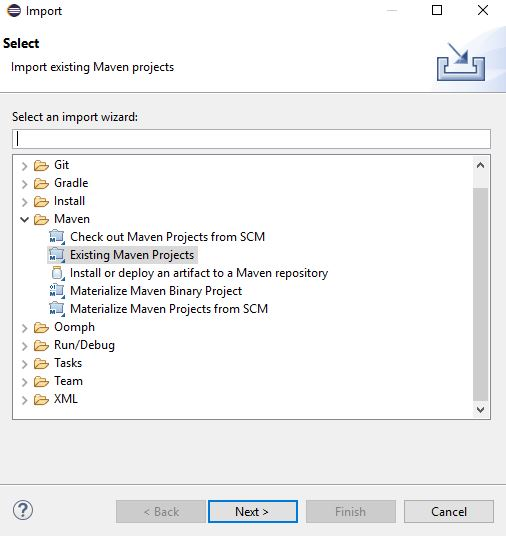
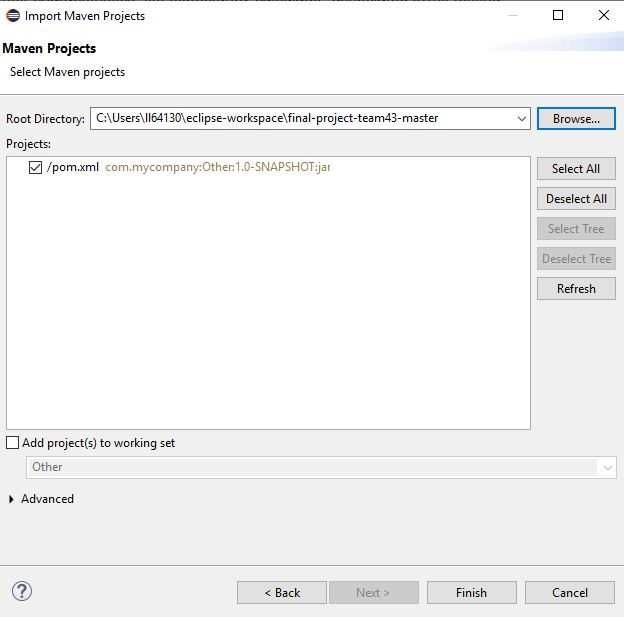
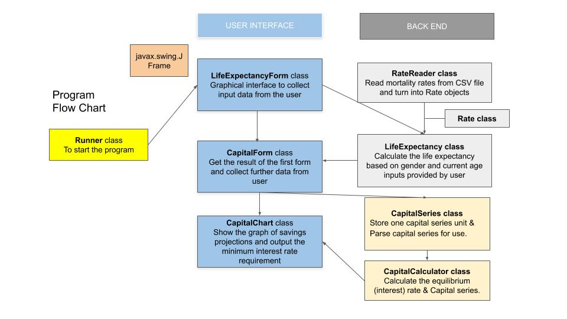
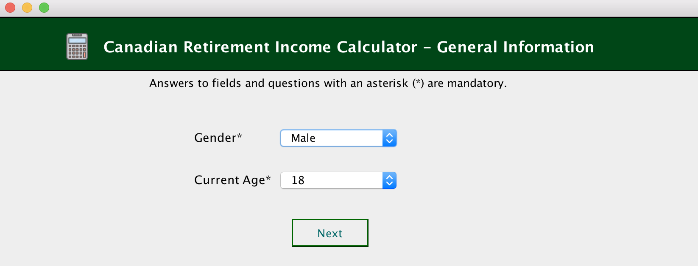
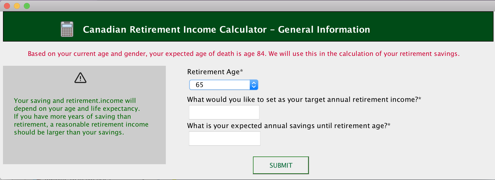
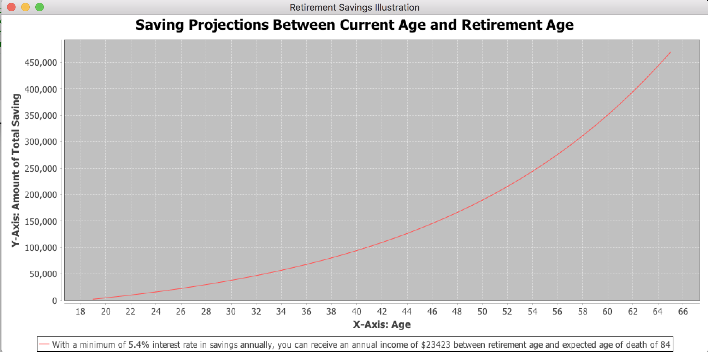
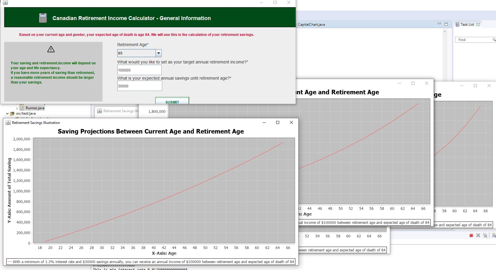

# final-project-team43
final-project-team43 created by GitHub Classroom  

### CIT 591 FINAL PROJECT - RETIREMENT INCOME CALCULATOR

### HOW TO IMPORT THE PROGRAM IN ECLIPSE
* From Github, download the files and extracted the folder, e.g. “final-project-team43-master”
* In Eclipse, click File > Import and choose Maven > Existing Maven Projects

* Click Next and select the extracted folder earlier for Root Directory

* Click Finish

### CALCULATOR DESIGN

### CALCULATOR FUNCTIONALITIES - HOW TO RUN
* Go to the Runner class and click Run
* The first form will appear:

* Choose the appropriate gender and current age (between 18 and 64 for a working Canadian). Then click Next. The second form as above will appear. 

* It first lets the user know their expected age of death. This will be used  into the calculation of the retirement plan.
The user then choose their Retirement Age (between 65 and 85) and  provide positive integers for their retirement plan, specifically:
1. What is their target annual retirement income (that they will earn between retirement age until they expect to die)?
2. What is their expected annual savings between current age and retirement age?
* Once the users provide all the inputs, it will shows the projections of savings between current age and retirement age to illustrate how much savings will need to grow in order to have enough savings to pay out the target annual retirement income during retirement years. It also provides the minimum interest rate required to invest the savings in order to achieve the target annual retirement income during retirement years until the expected age of death. 

* You can re-enter the inputs in the second form and new results with charts will appear for comparison purpose. To close the program, you can close any of of the form/chart.

