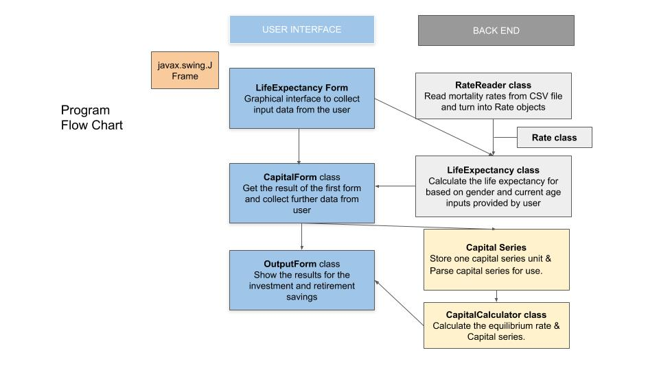

# final-project-team43
final-project-team43 created by GitHub Classroom  

### CIT 591 FINAL PROJECT - RETIREMENT INCOME CALCULATOR

### HOW TO IMPORT THE PROGRAM IN ECLIPSE
* From Github, download the files and extracted the folder, e.g. “final-project-team43-master”
* In Eclipse, click File > Import and choose Maven > Existing Maven Projects

* Click Next and select the extracted folder earlier for Root Directory

* Click Finish

### CALCULATOR DESIGN

### CALCULATOR FUNCTIONALITIES - HOW TO RUN
* Go to the Runner class and click Run
* The first form will appear:

* Choose the appropriate gender and current age (between 18 and 64 for a working Canadian). Then click Next.

* The second form as above will appear. It first lets the user know their life expectancy, i.e. the expected number of years they will still live. This will be taken into account into the calculation of the retirement plan.
The user then choose their Retirement Age (between 65 and 85 for a typical working Canadian) and then provide positive integers for their retirement plan, specifically:
1. What is their target annual retirement income (that they will earn between retirement age until they expect to die)?
2. What is their expected annual savings until retirement age?

